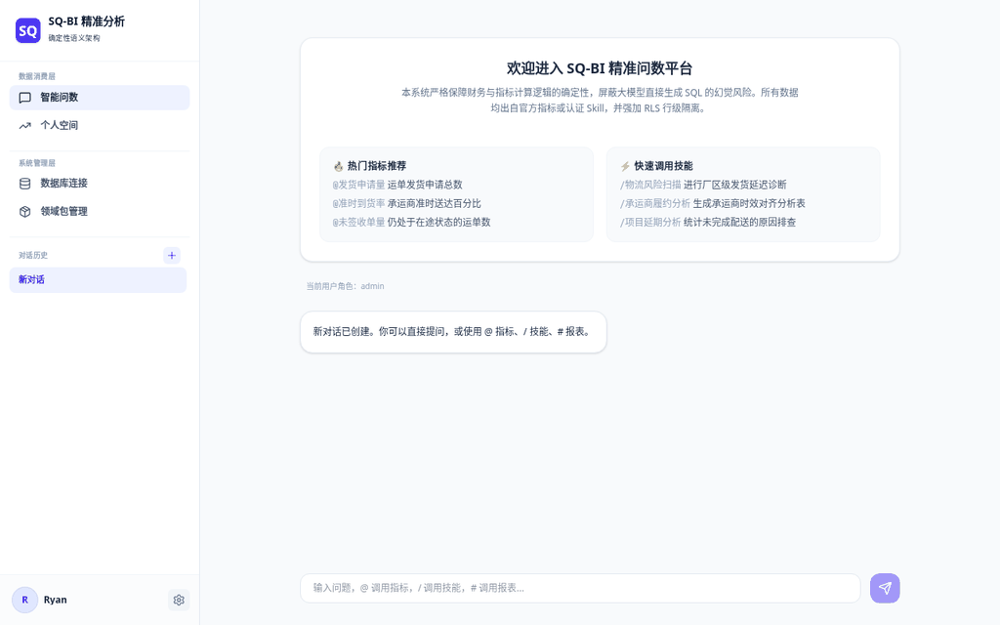

# SQ-BI · 智慧问数

[](https://github.com/renyumm/sq-bi/actions/workflows/ci.yml)
[](https://github.com/renyumm/sq-bi/stargazers)
[](https://github.com/renyumm/sq-bi/issues)
[](LICENSE)

**让业务人员像提问一样使用数据。** SQ-BI 是面向制造、物流与企业运营的 AI-Native BI 平台：大模型负责理解问题、规划分析和组织回答，版本化的指标、技能与报表负责确定性计算——每一个答案都带着资产版本、字段来源和血缘证据。

<p align="center">
  
</p>

> 当前阶段：Community Preview。适合本地验证、产品共创和二次开发；面向公网或生产数据部署前，请完成密钥轮换、外部身份接入、持久化导出存储和安全评审。

## 为什么选择 SQ-BI

**答案可信，而不是"看起来对"。**
Text-to-SQL 让模型直接生成 SQL：对了无法复用，错了无从审计。SQ-BI 默认不让模型写任意 SQL——问题被路由到治理过的指标和技能上确定性执行，SQL AST 防护、权限隔离与执行预算全程兜底。每个答案都能回答三个问题：用了哪个版本的口径、读了哪些字段、数据从哪来。

**行业知识一次沉淀，处处复用。**
标准字段、指标口径、分析技能打包为可移植的领域包。指标用标准字段的逻辑表达式定义（如 `rate(actual_time <= plan_time)`），引擎在部署时结合字段映射自动编译为目标库的方言 SQL——Oracle、PostgreSQL、MySQL、ClickHouse 同一套口径。换一家工厂，不必重做实施。

**AI 自动挂载，实施从"周"缩到"天"。**
接入新数据库时，LLM 自动匹配领域包标准字段与客户物理 schema，逐项给出置信度与理由；低置信项走对话式澄清，冒烟测试通过后才激活。替代传统 BI 项目里最耗时的手工映射与口径对齐。

**追问和下钻真正可用。**
多轮对话优先沿用原有资产做维度下钻和趋势对比，`@` 指标、`/` 技能、`#` 报表随手引用；查询失败时明确报告失败原因，绝不静默更换口径来"凑出一个答案"。

## 它为谁服务

- **业务用户**：不必学 SQL，连续追问指标、下钻维度，直接获得合适的表格或趋势图。
- **业务分析师**：把口径、依赖和分析流程沉淀为指标、技能和报表，同一问题不再反复手工取数。
- **IT/数据团队**：通过领域包把标准字段和资产挂载到不同语义空间，而不是把数据库结构写死在提示词里。
- **管理者**：追溯每个回答用了哪个版本的资产、哪些字段与数据源，而不是相信一段不可解释的生成 SQL。

## 工作原理

企业问数的关键不是"让模型写出更多 SQL"，而是让模型在受控边界内调度可信资产：

```text
自然语言与上下文
      ↓
LLM 识别目标、参数、维度与展示意图
      ↓
正式指标/Skill/报表 → 语义空间探索 → 数据库 Catalog 探索
      ↓
受控工具、SQL 防护、预算和超时边界
      ↓
拟人化回答 + 自适应可视化 + 资产/字段/血缘证据
```

## 产品能力

- Oracle、PostgreSQL、MySQL、ClickHouse 数据源及独立连接生命周期。
- 官方/企业领域包、扩展层、字段映射、冒烟测试与激活状态机。
- `@` 指标、`/` 技能、`#` 报表的持续对话问数。
- 跨数据源受控规划、指标复用、维度下钻、趋势/对比展示。
- 个人资产的 AI 对话创建、受控测试、同步确认和版本引用。
- HTML 报告、导出、分享与订阅服务。
- SQL AST 防护、权限隔离、执行预算、审计与字段级血缘。

## 与其他方案的差异

| 路线 | 典型产品 | 常见做法 | SQ-BI 的侧重点 |
|---|---|---|---|
| 传统 BI + Copilot | [Power BI Copilot](https://learn.microsoft.com/en-us/power-bi/create-reports/copilot-introduction)、Tableau | 围绕语义模型、报表和可视化提供问答或辅助创作 | 领域包挂载、版本化执行资产和完整运行证据 |
| 搜索/对话分析 | ThoughtSpot 等 | 自然语言搜索、即时洞察与可视化 | 正式资产优先、失败不静默换口径、连续维度下钻 |
| 指标/语义层 | [dbt Semantic Layer](https://docs.getdbt.com/docs/use-dbt-semantic-layer/dbt-sl)、[Cube](https://cube.dev/docs/product/semantic-layer/overview) | 集中定义指标并向多个消费工具提供一致语义 | 将指标继续组合为可调用技能、报告和 AI 工具链 |
| Text-to-SQL 框架 | Vanna、DB-GPT 等 | 用模型和 Schema/示例生成或检索 SQL | 默认不让模型直接生成任意 SQL，执行受资产和工具契约约束 |

SQ-BI 不试图替代所有可视化或数据建模工具；它的定位是"可治理的对话分析与领域资产运行层"。

## 五分钟部署

要求：Podman Compose、`podman-compose` 或 Docker Compose 三者之一。

```bash
cp .env.example .env
# 编辑 .env，填写模型端点、模型名、API Key，并替换安全密钥
./scripts/deploy.sh up
```

浏览器访问 `http://localhost:8080`。常用操作：`./scripts/deploy.sh status | logs | restart | down`。

默认账号仅用于本地首次登录：`admin / admin123`，登录后应立即在系统管理中修改密码。运行时状态保存在命名卷 `sqbi-data`，删除容器不会丢失数据。

## 质量保障

我们用工程标准要求 AI 产品的输出质量：

- CI 覆盖 770+ 个后端回归用例与前端构建，每次提交自动运行。
- 对话准确率用多轮评测集衡量——检查资产命中、下钻维度字段、血缘证据和延迟，而不只是"请求成功"。
- 准确率结果始终绑定测试集、数据快照、模型和日期，不发布脱离环境的单一百分比。

方法与最新基线详见[质量与评测](docs/quality.md)。

## Roadmap

- 企业身份接入（SSO）、细粒度 RBAC 与密钥托管。
- 更多官方领域包，以及领域包注册表/市场。
- 横向扩容部署：外部任务队列与对象存储。
- 公开、可复现的准确率基准与按版本聚合的质量趋势看板。

## 开发与贡献

```bash
uv sync --all-packages --extra dev          # Python 工作区
cd services/runtime && uv run uvicorn sq_bi_runtime.api:app --reload   # 后端 :8000
cd apps/web && npm ci && npm run dev        # 前端 :5173
./scripts/test-all.sh                       # 全量测试
```

代码结构、约定与提交流程见 [CONTRIBUTING.md](CONTRIBUTING.md)。提交 Issue 时请附复现步骤、数据源类型、领域包/资产版本和脱敏后的运行 trace；请勿提交 `.env`、`.local` 或真实数据库凭据。

本项目采用 [Apache License 2.0](LICENSE)。
